# 📄 PROCESSO – IMPLANTAÇÃO DASH 3

Processo feito a partir do vídeo:  
[https://drive.google.com/file/d/1VdGrTgD7BJjoLTxPtmgE0ka2W5iSU4KX/view](https://drive.google.com/file/d/1VdGrTgD7BJjoLTxPtmgE0ka2W5iSU4KX/view)

---

## 📊 SEÇÃO 1 – GOOGLE SHEETS

### Passo 1:
Acessar pasta `#Onboarding` nos clientes ativos do drive:  
[https://drive.google.com/drive/folders/1cjjwIJ3lBMW_Cmb31Ck6k5Gv1eDKfEeS](https://drive.google.com/drive/folders/1cjjwIJ3lBMW_Cmb31Ck6k5Gv1eDKfEeS)  
Procurar a companhia correta para fazer o dash 3.  
**Exemplo:** Don Carlos Pizzaria

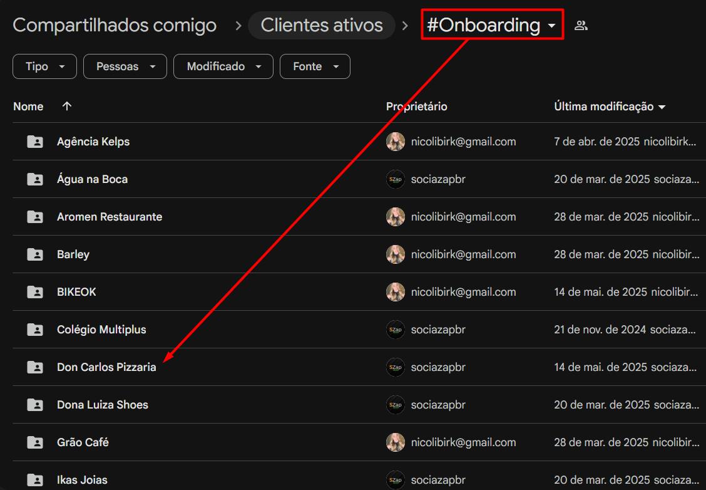

### Passo 2:
Dentro da pasta da companhia, encontrar a planilha chamada **"Dados"**.

> **IMPORTANTE:**  
> Caso não tenha nenhum dado na planilha, copie dados de outra companhia na primeira linha após o cabeçalho.  
> A primeira linha sempre será de teste.  
> O importante é estar preenchida até a **“data da última campanha”**.

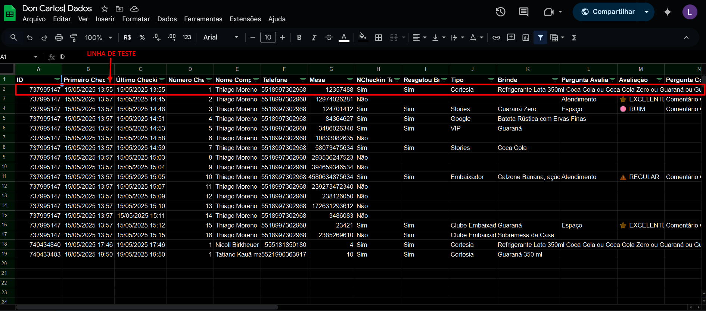

### Passo 3:
Dentro da planilha, acesse a página **"TEMPO"** e preencha todos os check-ins da primeira linha com `1`.

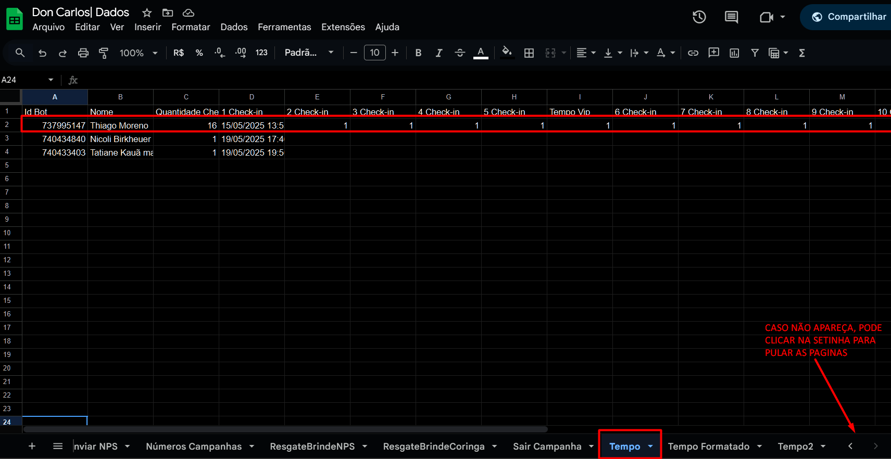

---

## 📈 SEÇÃO 2 – DUPLICAR DASH NO LOOKER STUDIO

### Passo 1:
Acesse o Looker Studio:  
[https://lookerstudio.google.com/navigation/reporting](https://lookerstudio.google.com/navigation/reporting)  
Entre na conta da SocialZap e escolha um cliente recente (ex: Grão Café).

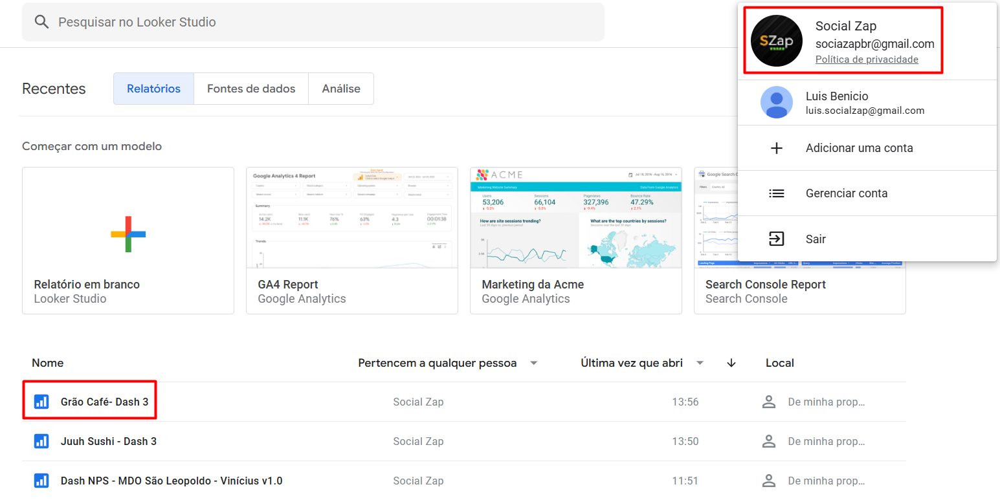

### Passo 2:
Dentro do dash já pronto, clique nos três pontinhos e escolha **“Fazer uma cópia”**.

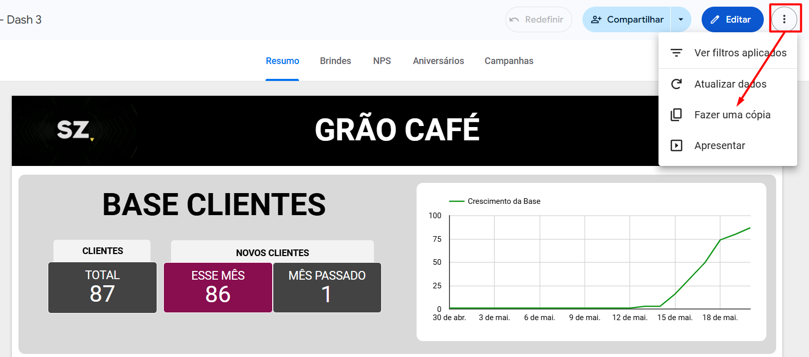

### Passo 3:
Na tela de cópia do dash, vá na aba de **nova fonte de dados**, selecione uma fonte e clique em **“Criar fonte de dados”**.

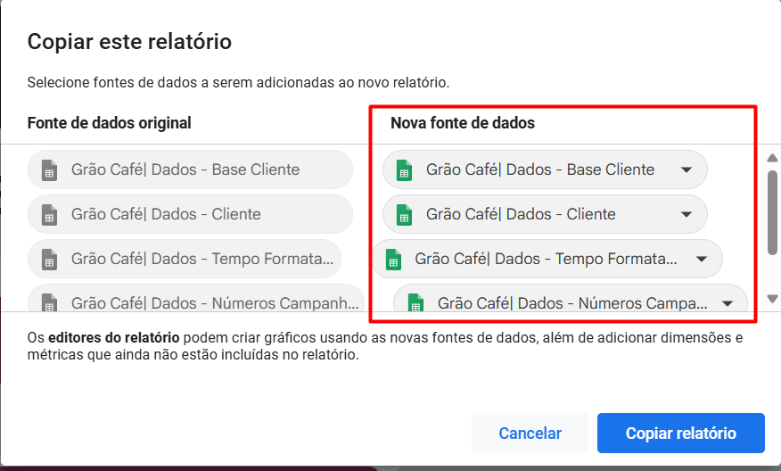
.png)

### Passo 4:
Na parte da planilha, escolha a companhia (ex: Don Carlos Pizzaria).  
Na aba de página, selecione a mesma da fonte de dados escolhida na cópia do relatório.  
Clique em **“Conectar”** e depois em **“Adicionar ao relatório”**.

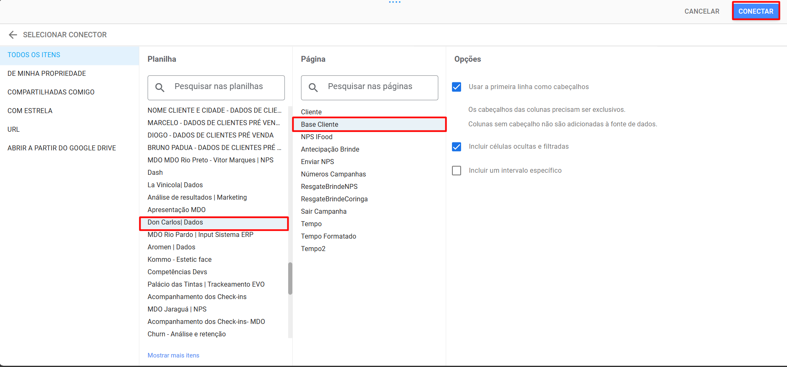
.png)

### Passo 5:
Ao final, a tela deve estar parecida com o exemplo.  
Clique em **“Copiar relatório”**.

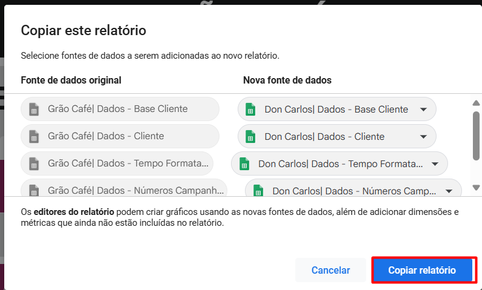

---

## 🛠 SEÇÃO 3 – EDITAR E VERIFICAR O DASH

### Passo 1:
No Looker Studio, altere o nome do dash no canto superior esquerdo.

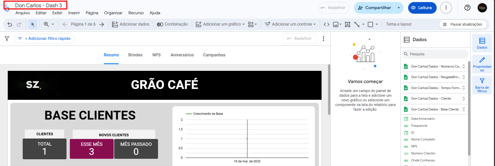

### Passo 2:
Clique em **“Compartilhar”**  
Altere o link de **“Restrito”** para **“Público”** com permissão de **Leitor**.  
Clique em **“Salvar”**.

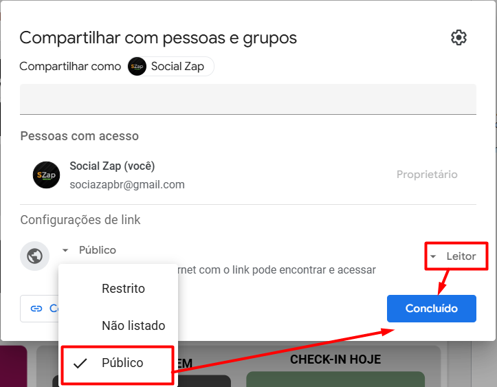

### Passo 3:
Copie o link do dash.  
Abra a planilha “DASHBOARDS”:  
[https://docs.google.com/spreadsheets/d/1QUQums3KEoXGz7PR694z4ymCae_S9uHML7X6qXGnVIc/edit?gid=530077036#gid=530077036](https://docs.google.com/spreadsheets/d/1QUQums3KEoXGz7PR694z4ymCae_S9uHML7X6qXGnVIc/edit?gid=530077036)  
Vá até a aba de dados e adicione a companhia por ordem alfabética.

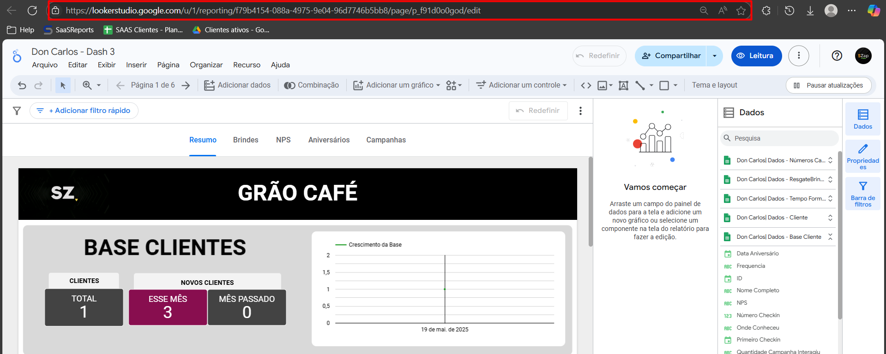
.png)

### Passo 4:
Na aba “DASHBOARDS”, preencha os seguintes campos:

- **CLIENTE:** Nome da companhia  
- **TIPO DE DASH:** Tipo de estabelecimento  
- **LINK LIMPO:** Link do dash copiado  
- **VERSÃO:** Versão do dash (ex: `v1.0` se for o primeiro)  
- **APROVAÇÃO:** Colocar como **verde**  
- **SITUAÇÃO:** Colocar como **ativo**

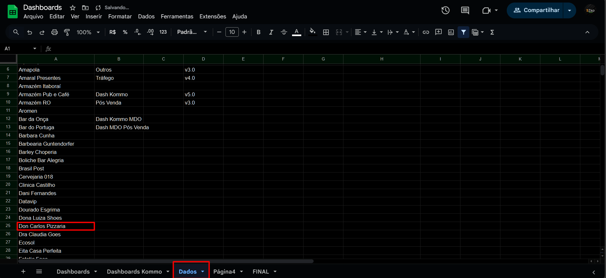
.png)

### Passo 5:
Clique no título do dash e altere para o nome correto.

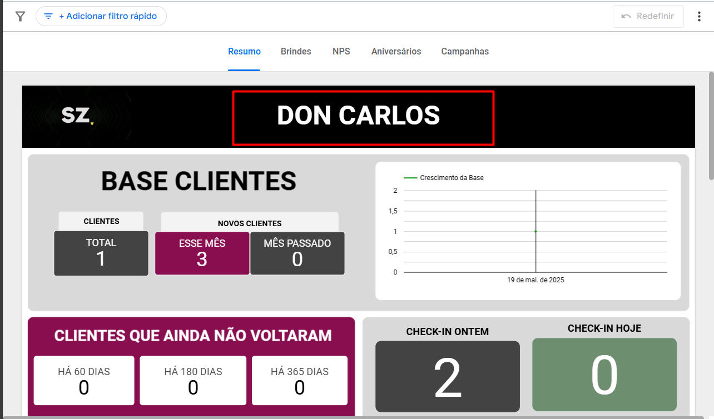

### Passo 6:
Revisar todos os gráficos do dash copiado e comparar com o original.  
Verifique **propriedades**, **campos de origem** e **bases de dados**.

> **Dica:**  
> Para abrir as propriedades de um gráfico, clique sobre ele.

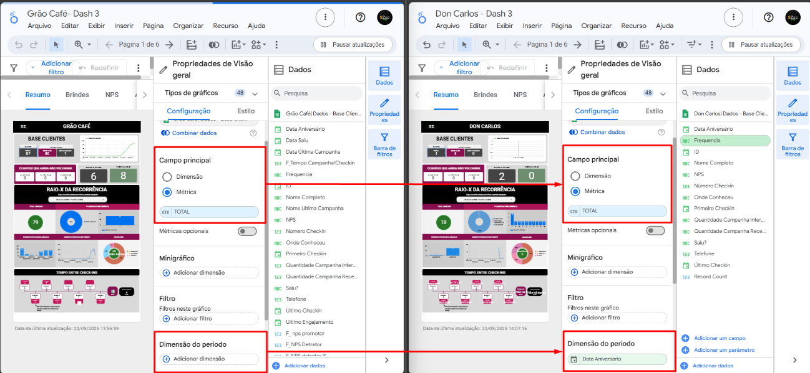

**NOTA:** Nesse caso a aba “campo principal” está correto, pois na propriedade do gráfico da Don Carlos esta igual ao gráfico da Grão Café. Porém na aba “dimensão do período” está diferente, nesse caso precisamos excluir o campo da Don Carlos para ficar igual ao da Grão Café.

### Passo 7:
No gráfico de **NPS**, será necessário criar fórmulas personalizadas:

- Clique no campo **Recurso**  
- Vá em **“Gerenciar fontes de dados selecionadas”** e **editar**

> **Nota:**  
> Verifique se está criando na **fonte de dados correta** clicando no gráfico e conferindo a “Fonte de dados”.

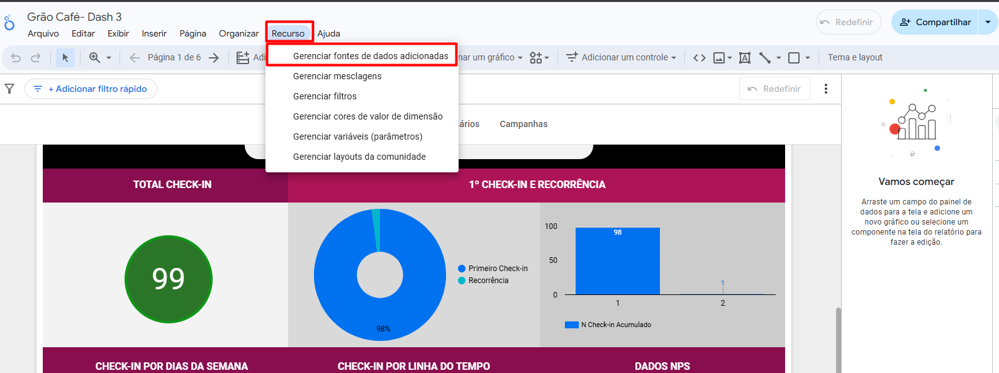
.png)

### Passo 8:
Clique em **“Adicionar um campo”** e depois em **“Adicionar campo calculado”**

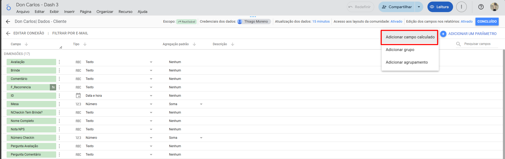

### Passo 9:
Crie as fórmulas na seguinte ordem:

1. `NPS_promotor`  
2. `NPS_detrator`  
3. `NPS_total`  
4. `NPS_promotor%`  
5. `NPS_detrator%`  
6. `NPS_final`

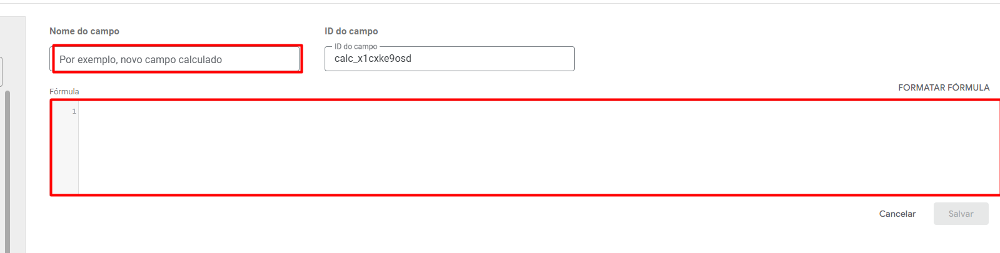
**NOTA:** Antes de copiar as fórmulas, verifique como está escrito na planilha, por padrão as fórmulas estão apenas como ‘promotor’ / ‘detrator’, porém dependendo da planilha ela pode estar como ‘promotor🟢’, e caso não for corrigido a fórmula vai quebrar.

### Passo 10:
Continue ajustando o dash comparando com o original (já implantado).  
Faça isso para todas as páginas do relatório.
Qualquer duvida aconselho verificar com responsavel ou no video indicado no começo do processo.
